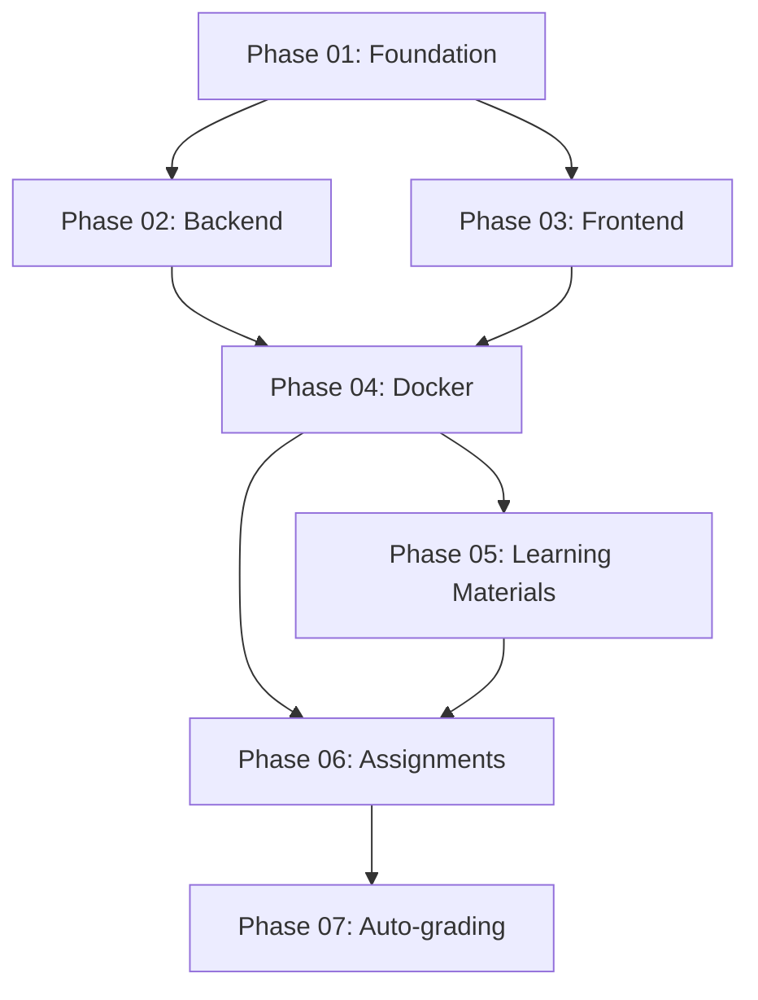

# DevOps Classroom Teaching Resource - Implementation Plan

## Overview

Create comprehensive GitHub Classroom template for teaching Docker and CI/CD to beginners through 7 progressive modules with auto-grading.

**Target Audience**: Beginners to Docker/DevOps
**Deployment**: Local development + VM deployment
**Tech Stack**: Node.js 20, Express, React 18, Vite, PostgreSQL, Docker, GitHub Actions

## Implementation Phases

### Phase 01: Project Foundation & Structure
**Status**: ⬜ Pending | **Effort**: 2h | **File**: [phase-01-foundation.md](phase-01-foundation.md)
- Create repository structure
- Setup application skeleton (backend + frontend + database)
- Base documentation framework

### Phase 02: Simple Backend API Implementation
**Status**: ⬜ Pending | **Effort**: 2h | **File**: [phase-02-backend-api.md](phase-02-backend-api.md)
- Node.js/Express REST API (todos CRUD)
- PostgreSQL integration
- Environment configuration
- Simple, well-commented code for learning

### Phase 03: React Frontend Implementation
**Status**: ⬜ Pending | **Effort**: 2h | **File**: [phase-03-frontend.md](phase-03-frontend.md)
- React 18 + Vite setup
- Simple UI for todos management
- API integration
- Development server configuration

### Phase 04: Docker Setup & Configurations
**Status**: ⬜ Pending | **Effort**: 3h | **File**: [phase-04-docker-setup.md](phase-04-docker-setup.md)
- Backend Dockerfile (multi-stage)
- Frontend Dockerfile (multi-stage + nginx)
- docker-compose.yml (dev + production)
- .dockerignore files
- Environment examples

### Phase 05: Learning Materials & Documentation
**Status**: ⬜ Pending | **Effort**: 3h | **File**: [phase-05-learning-materials.md](phase-05-learning-materials.md)
- Comprehensive README with learning objectives
- Docker tutorial (step-by-step)
- CI/CD concepts guide
- Troubleshooting guide
- Best practices document

### Phase 06: Student Assignments & Exercises
**Status**: ⬜ Pending | **Effort**: 4h | **File**: [phase-06-assignments.md](phase-06-assignments.md)
- Module 1: Dockerize backend
- Module 2: Dockerize frontend
- Module 3: Docker Compose setup
- Module 4: Multi-stage builds optimization
- Module 5: GitHub Actions basic CI
- Module 6: Complete CI/CD pipeline
- Module 7: VM deployment
- Starter code with TODOs

### Phase 07: Auto-Grading System
**Status**: ⬜ Pending | **Effort**: 4h | **File**: [phase-07-autograding.md](phase-07-autograding.md)
- GitHub Classroom configuration
- Auto-grading workflows per module
- Validation scripts (Docker build, run, health checks)
- Feedback mechanisms
- Points system integration

## Dependencies

## Key Success Metrics

- ✅ All 7 modules with working starter code
- ✅ Docker configurations build and run successfully
- ✅ Auto-grading validates all module requirements
- ✅ Clear, beginner-friendly documentation
- ✅ VM deployment works with docker-compose
- ✅ Students receive helpful feedback on mistakes

## Risk Mitigation

| Risk | Impact | Mitigation |
|------|--------|------------|
| Auto-grading too complex | High | Start simple, progressive complexity |
| Docker setup fails on student machines | High | Comprehensive troubleshooting guide |
| Assignments too difficult | Medium | Clear starter code, step-by-step instructions |
| VM deployment issues | Medium | Test on multiple Linux distributions |

## Research References

- [Docker Teaching Research](research/researcher-01-docker-teaching.md)
- [GitHub Classroom Auto-grading Research](research/researcher-02-classroom-autograding.md)
